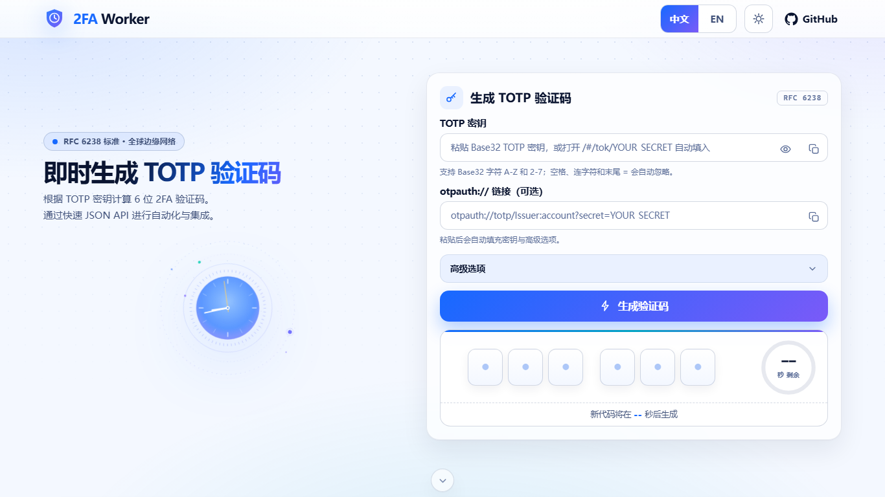

<div align="center">

# 2FA Worker

**部署在 Cloudflare 全球边缘的无状态 TOTP 验证码生成器**

零数据库 · 零持久化 · 密钥可不出浏览器 · 一个 Worker 跑完全部

[](https://github.com/deeeeeeeeap/2fa-cfworker/actions/workflows/ci.yml)


[](https://deploy.workers.cloudflare.com/?url=https://github.com/deeeeeeeeap/2fa-cfworker)

<picture>
  <source media="(prefers-color-scheme: dark)" srcset="docs/screenshot-dark.png">
  
</picture>

</div>

---

## 特性

- **无状态运行** — 无数据库、无 KV、无持久化存储依赖，部署即用。
- **浏览器本地生成** — 首页 UI 内置完整 TOTP 实现（Web Crypto），密钥可以不发送到服务器；也提供 `POST /api/totp` JSON API 用于自动化。
- **标准完备** — RFC 6238 / RFC 4226，支持 `SHA1` / `SHA256` / `SHA512`，6–8 位验证码，周期与 `t0` 可调。
- **兼容旧工具** — `2fa.live` 风格的 `/tok/<secret>` 接口开箱即用。
- **隐私优先** — 默认关闭 persisted observability、invocation logs 与 Logpush；HTML/API 全部 `no-store`；静态检查拦截任何可能记录 secret 的代码。
- **安全纵深** — CSP（script + style 双 nonce）、HSTS、每 IP 限流（20 次 / 10 秒，可调）、流式 body 限长、安全响应头全家桶。
- **质感 UI** — 「时间仪器」风格界面：深浅双主题、SVG 轨道时钟、逐位验证码单元格、平滑倒计时环、中英双语、本机时钟漂移检测；除 favicon 外全部资产为内联 SVG。
- **工程化兜底** — RFC 测试向量双实现交叉验证、客户端/服务端算法漂移测试、TypeScript 检查、gzip 体积预算、GitHub Actions CI。

## 快速开始

### 一键部署

点击下面按钮，Cloudflare 会基于本仓库在你的账户里创建项目、配置 Workers Builds（CI/CD）并完成首次部署：

[](https://deploy.workers.cloudflare.com/?url=https://github.com/deeeeeeeeap/2fa-cfworker)

部署完成后访问 `https://<your-worker>.<your-subdomain>.workers.dev/` 即可使用。

### 本地运行

要求 Node.js >= 22。

```bash
npm ci
npm run dev -- --port 8787
# 打开 http://127.0.0.1:8787/
```

提交前运行完整检查（typecheck、测试、RFC 向量、日志隐私静态检查、Wrangler dry-run 与体积预算）：

```bash
npm run check
```

## 路由与 API

| Method | Path | 说明 |
| --- | --- | --- |
| `GET` | `/` | 浏览器 TOTP UI（本地生成，密钥不出浏览器） |
| `POST` | `/api/totp` | **推荐**的 JSON API，适合自动化集成 |
| `GET` | `/api/totp?secret=<BASE32>` | 同上的 GET 形式；URL 携带 secret，仅建议临时使用 |
| `GET` | `/tok/<BASE32_SECRET>` | 兼容 `2fa.live` 风格，返回 `{"token":"123456"}` |
| `GET` | `/healthz` | 健康检查，返回 `{"ok":true}` |
| `GET` | `/robots.txt` | 禁止爬虫索引 |
| `GET` | `/favicon.ico` 等 | favicon 图片路由（可缓存） |

所有 `GET` 路由同时支持 `HEAD`。

### POST /api/totp

```bash
curl -X POST "https://<your-worker>.workers.dev/api/totp" \
  -H "Content-Type: application/json" \
  -d '{"secret":"GEZDGNBVGY3TQOJQGEZDGNBVGY3TQOJQ","period":30,"digits":6,"algorithm":"SHA1"}'
```

成功响应：

```json
{
  "token": "123456",
  "period": 30,
  "remaining": 23,
  "remainingMs": 23125,
  "validUntil": "2026-06-09T01:23:30.000Z",
  "digits": 6,
  "algorithm": "SHA1",
  "counter": "58600000"
}
```

`GET /api/totp` 支持与 POST body 一致的查询参数：`secret`、`period`、`digits`、`algorithm`、`time`（Unix 秒）、`timestampMs`（Unix 毫秒，二者同时提供时优先）、`t0`。

### 浏览器自动填入

使用 fragment 形式打开 `/#/tok/<secret>`：fragment 不会发送到服务器，页面读取后会自动清理地址栏。

## 部署

### 通过 Wrangler CLI

```bash
npx wrangler login   # 登录 Cloudflare
npm run check        # 部署前检查
npm run deploy
```

按需修改 `wrangler.jsonc`：

```jsonc
{
  "name": "2fa-cfworker",          // 须与 Dashboard 中的 Worker 名称一致
  "main": "src/index.ts",
  "compatibility_date": "2026-06-08",
  "workers_dev": true
}
```

> 如果 Dashboard 中已有同名 Worker，`name` 必须与之一致，否则 Workers Builds 可能部署到非预期 Worker。

### 通过 GitHub + Cloudflare Workers Builds

仓库已包含 `wrangler.jsonc`、`package-lock.json` 与 GitHub Actions CI（push 到 `main` / PR 时运行 `npm ci && npm run check`），可直接连接 Workers Builds：

| 配置项 | 建议值 |
| --- | --- |
| Production branch | `main` |
| Root directory | 留空（仓库根目录） |
| Node version | `22` |
| Build command | `npm ci && npm run check` |
| Deploy command | `npm run deploy` |

操作路径：Cloudflare Dashboard → Workers & Pages → Create application → Import a repository。

### 自定义域名

```jsonc
{
  "workers_dev": false,
  "routes": [
    { "pattern": "2fa.example.com", "custom_domain": true }
  ]
}
```

不要把真实域名、token、cookie 或私钥写进仓库。

### 体积预算

默认 gzip budget 为 `64 KiB`，可用环境变量调整：

```bash
MAX_GZIP_KIB=128 npm run size
```

Windows PowerShell 下：

```powershell
$env:MAX_GZIP_KIB = "128"; npm run size
```

## 安全说明

- 优先使用首页 UI（本地生成）或 `POST /api/totp`。
- `/tok/<secret>` 和 `GET /api/totp?secret=...` 会把 secret 放进 URL，仅建议兼容旧工具或临时测试。
- API **有意不返回 CORS 头**：跨源浏览器调用会失败，这是防止第三方页面读取 token 的设计，请勿“修复”。自动化请走服务器端或 CLI。
- 不要开启会记录 URL path、query、body、decoded secret 或 generated token 的日志、分析、追踪、Logpush 或第三方可观测性管道。
- 代码内置每 IP 限流（20 次 / 10 秒，每个 Cloudflare 节点独立计数）；公开部署仍必须在 Dashboard 为 `/api/totp` 与 `/tok/*` 叠加 WAF / Rate Limiting 与用量告警；仅自用建议考虑 Cloudflare Access。
- 更多操作细则见 [SECURITY.md](SECURITY.md)。

### 生产日志隐私检查清单

URL 中携带的 TOTP secret 可能出现在浏览器历史、截图、反向代理日志、Cloudflare Workers invocation logs、Logpush、Tail Workers、第三方 APM 或 SIEM 中。生产部署前请确认：

- 不记录 `request.url`、path、query、request body、decoded secret、generated token 或 IP+secret 组合。
- 如需开启 Cloudflare observability，必须保持 `observability.logs.invocation_logs = false`，并确认日志不会持久化或导出敏感字段。
- 自动化调用优先使用 `POST /api/totp`，避免把 secret 放进 URL。
- 不把真实 secret、token、cookie、API key 写入 README、测试、Issue、PR、提交信息、截图或日志。

`wrangler.jsonc` 默认关闭 persisted observability、invocation logs、trace persistence 和 Logpush；`tests/privacy-config.test.ts` 会在 CI 中锁住这些默认值。

## 部署前检查

```bash
npm ci
npm run check
git diff --check
npm run deploy:dry-run
```

本地 HTTP smoke test：

```bash
npm run dev -- --port 8787
curl -i http://127.0.0.1:8787/healthz
curl -i -X POST "http://127.0.0.1:8787/api/totp" \
  -H "Content-Type: application/json" \
  -d '{"secret":"GEZDGNBVGY3TQOJQGEZDGNBVGY3TQOJQ"}'
```

部署后至少确认：

- 首页可打开且 HTML 响应为 `Cache-Control: no-store, max-age=0`。
- `/healthz` 返回 `{"ok":true}`。
- `/api/totp` 与 `/tok/<BASE32_SECRET>` 响应包含 `X-Robots-Tag: noindex, nofollow, noarchive`。
- Dashboard 没有启用会持久保存 URL、query、body、secret 或 token 的日志导出。

## Troubleshooting

| 问题 | 处理方式 |
| --- | --- |
| Node 版本错误 | 使用 Node.js 22+；Workers Builds 里显式设置 Node version 为 `22`。 |
| `npm ci` 提示 lockfile 不一致 | 本地 `npm install` 更新 `package-lock.json`，`npm run check` 通过后再提交。 |
| Wrangler 未登录 | 本地部署前 `npx wrangler login`；CI 使用平台授权，不要把 token 写进仓库。 |
| 部署到错误 Worker | 检查 `wrangler.jsonc` 的 `name` 与 Dashboard 目标 Worker 名称是否一致。 |
| API 返回 invalid secret | secret 须为 Base32 字符 `A-Z` `2-7`；空格、连字符和末尾 `=` 自动忽略。 |
| 验证码对不上 | 检查本机时钟（页面会自动检测漂移并提示）；确认 `period` / `digits` / `algorithm` 与签发方一致。 |

## 项目结构

```text
.
├── src/index.ts                  # Worker 入口：HTTP 路由、安全响应头、限流
├── src/totp-core.ts              # TOTP/HOTP 算法与输入校验（纯函数，无 HTTP 依赖）
├── src/page.ts                   # 首页 UI（主题系统、CSS、客户端 JS、内联 SVG、HTML）
├── src/assets.ts                 # favicon 资源与图片路由映射
├── tests/                        # Vitest：路由、TOTP 向量、客户端漂移、隐私配置
├── scripts/check-vectors.mjs     # RFC 测试向量交叉验证（独立参考实现）
├── scripts/security-guard.mjs    # 日志隐私静态检查
├── scripts/size-budget-check.mjs # Wrangler dry-run gzip 体积预算
├── .github/workflows/ci.yml      # GitHub Actions CI
├── vitest.config.ts              # 测试池配置（CI 在 workerd 运行时执行）
├── wrangler.jsonc                # Cloudflare Workers 配置（含限流 binding）
└── SECURITY.md                   # 安全使用说明
```

## 常用命令

```bash
npm ci                 # 安装依赖
npm run dev            # 本地开发（wrangler dev）
npm run check          # 全量检查：typecheck + 测试 + 向量 + 安全 + 体积
npm run test           # 仅测试
npm run deploy:dry-run # 构建检查（不部署）
npm run deploy         # 部署
```

## 参考文档

- [Deploy to Cloudflare buttons](https://developers.cloudflare.com/workers/platform/deploy-buttons/)
- [Cloudflare Workers Builds](https://developers.cloudflare.com/workers/ci-cd/builds/)
- [Wrangler commands](https://developers.cloudflare.com/workers/wrangler/commands/)
- [RFC 6238 — TOTP](https://www.rfc-editor.org/rfc/rfc6238) / [RFC 4226 — HOTP](https://www.rfc-editor.org/rfc/rfc4226)
